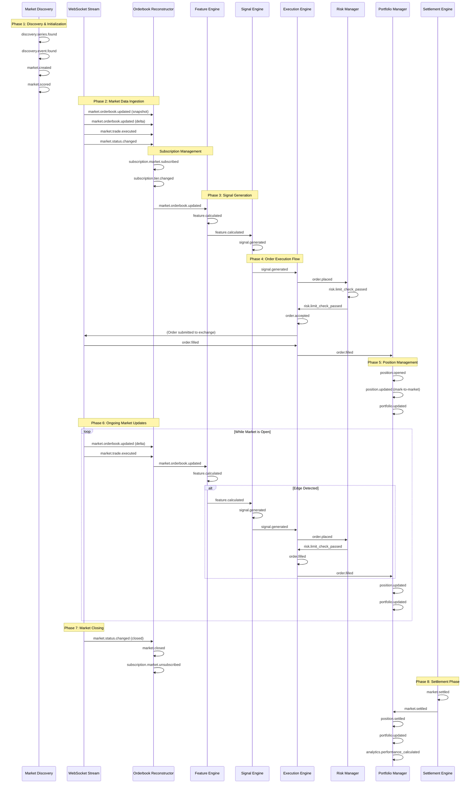

# Event Schemas

This document describes the event schema standard and all event types used in KalshiHub based on the trade management architecture.

## Standard Event Schema

All events published to Pub/Sub follow this standard schema:

```json
{
  "event_id": "uuid",
  "event_type": "event.category.action",
  "timestamp": "ISO8601",
  "source": "component-name",
  "version": "1.0",
  "metadata": {},
  "correlation_id": "optional-uuid"
}
```

### Fields

- **event_id**: Unique identifier for this event instance (UUID)
- **event_type**: Dot-separated event type (category.action)
- **timestamp**: ISO8601 formatted timestamp
- **source**: Component/service that generated the event
- **version**: Schema version (currently "1.0")
- **metadata**: Event-specific data (structure varies by event type)
- **correlation_id**: Optional UUID for tracking related events

## Event Types

### Market Lifecycle Events

Published to: `market-events`

#### market.created
Published when a new market is discovered/created by the Market Discovery Service.

```json
{
  "event_type": "market.created",
  "source": "market-discovery-service",
  "metadata": {
    "ticker": "NASDAQ-100-2024",
    "event_ticker": "EVENT-2024",
    "series_id": "ELECTIONS",
    "market_type": "binary",
    "status": "initialized",
    "open_time": "2024-01-01T00:00:00Z",
    "close_time": "2024-12-31T23:59:59Z",
    "settle_time": "2025-01-01T00:00:00Z",
    "category": "economics"
  }
}
```

#### market.updated
Published when market data changes (price, volume, status, etc.).

```json
{
  "event_type": "market.updated",
  "source": "market-data-stream",
  "metadata": {
    "ticker": "NASDAQ-100-2024",
    "changes": {
      "status": {"from": "open", "to": "closed"},
      "last_price_cents": {"from": 50, "to": 55},
      "volume_24h": {"from": 1000, "to": 1500}
    }
  }
}
```

#### market.closed
Published when a market closes for trading.

```json
{
  "event_type": "market.closed",
  "source": "market-data-stream",
  "metadata": {
    "ticker": "NASDAQ-100-2024",
    "close_time": "2024-12-31T23:59:59Z"
  }
}
```

#### market.settled
Published when a market settles with a result.

```json
{
  "event_type": "market.settled",
  "source": "settlement-engine",
  "metadata": {
    "ticker": "NASDAQ-100-2024",
    "result": "yes",
    "settlement_value_cents": 10000,
    "settlement_time": "2025-01-01T00:00:00Z"
  }
}
```

#### market.stale
Published when a market is detected as stale (not updated recently).

```json
{
  "event_type": "market.stale",
  "source": "market-discovery-service",
  "metadata": {
    "ticker": "NASDAQ-100-2024",
    "last_updated": "2024-01-01T12:00:00Z",
    "stale_duration_minutes": 10
  }
}
```

### Market Data Events

Published to: `market-events`

#### market.orderbook.updated
Published when order book data is updated (snapshot or delta applied).

```json
{
  "event_type": "market.orderbook.updated",
  "source": "orderbook-reconstructor",
  "metadata": {
    "ticker": "NASDAQ-100-2024",
    "update_type": "snapshot" | "delta",
    "sequence_id": 12345,
    "best_yes_bid_cents": 52,
    "best_no_bid_cents": 49,
    "spread_cents": 1,
    "yes_bid_depth": 200,
    "no_bid_depth": 180,
    "yes_ask_depth": 150,
    "no_ask_depth": 200
  },
  "correlation_id": "uuid"
}
```

#### market.trade.executed
Published when a trade is executed (from Trade stream).

```json
{
  "event_type": "market.trade.executed",
  "source": "market-data-stream",
  "metadata": {
    "ticker": "NASDAQ-100-2024",
    "trade_id": "trade-uuid",
    "price_cents": 52,
    "size_contracts": 100,
    "side": "yes" | "no",
    "timestamp": "2024-01-01T12:00:00Z"
  }
}
```

#### market.status.changed
Published when market status changes (halted, opened, closed, etc.).

```json
{
  "event_type": "market.status.changed",
  "source": "market-data-stream",
  "metadata": {
    "ticker": "NASDAQ-100-2024",
    "previous_status": "open",
    "new_status": "halted",
    "reason": "circuit_breaker" | "news" | "technical",
    "timestamp": "2024-01-01T12:00:00Z"
  }
}
```

### Discovery & Universe Events

Published to: `market-events`

#### discovery.series.found
Published when a new series is discovered.

```json
{
  "event_type": "discovery.series.found",
  "source": "market-discovery-service",
  "metadata": {
    "series_id": "ELECTIONS",
    "series_title": "Elections",
    "category": "politics"
  }
}
```

#### discovery.event.found
Published when a new event is discovered.

```json
{
  "event_type": "discovery.event.found",
  "source": "market-discovery-service",
  "metadata": {
    "event_ticker": "EVENT-2024",
    "series_id": "ELECTIONS",
    "event_title": "2024 Presidential Election",
    "event_start_time": "2024-01-01T00:00:00Z",
    "event_end_time": "2024-11-05T23:59:59Z"
  }
}
```

#### discovery.universe.refreshed
Published when the market universe is refreshed.

```json
{
  "event_type": "discovery.universe.refreshed",
  "source": "market-discovery-service",
  "metadata": {
    "total_markets": 1000,
    "new_markets": 50,
    "updated_markets": 200,
    "expired_markets": 10,
    "refresh_timestamp": "2024-01-01T12:00:00Z"
  }
}
```

### Feature & Signal Events

Published to: `market-events`

#### feature.calculated
Published when features are calculated for a market.

```json
{
  "event_type": "feature.calculated",
  "source": "feature-engine",
  "metadata": {
    "ticker": "NASDAQ-100-2024",
    "features": {
      "implied_probability_yes": 0.52,
      "mid_price_cents": 51.5,
      "spread_cents": 1,
      "depth_imbalance": 0.1,
      "microprice_cents": 51.6,
      "volatility_1min": 0.02,
      "volatility_5min": 0.05,
      "time_to_expiry_minutes": 1440,
      "effective_spread_cents": 1,
      "top_of_book_size": 200,
      "depth_3_cumulative": 800,
      "depth_5_cumulative": 1500,
      "parity_error_cents": 0,
      "fee_drag_cents": 0.5,
      "edge_bps": 85
    },
    "calculation_timestamp": "2024-01-01T12:00:00Z"
  },
  "correlation_id": "uuid"
}
```

#### signal.generated
Published when a trading signal is generated.

```json
{
  "event_type": "signal.generated",
  "source": "signal-engine",
  "metadata": {
    "signal_id": "signal-uuid",
    "ticker": "NASDAQ-100-2024",
    "signal_version": "1.3.0",
    "direction": "BUY_YES" | "SELL_YES" | "BUY_NO" | "SELL_NO",
    "limit_price_cents": 54,
    "urgency_bps": 25,
    "size_contracts": 120,
    "rationale": {
      "edge_bps": 85,
      "features": {
        "imb": 0.62,
        "spread_cents": 3,
        "volatility": 0.02,
        "liquidity_score": 0.8
      }
    },
    "ttl_ms": 8000,
    "generation_timestamp": "2024-01-01T12:00:00Z"
  },
  "correlation_id": "uuid"
}
```

#### signal.expired
Published when a signal expires without being executed.

```json
{
  "event_type": "signal.expired",
  "source": "signal-engine",
  "metadata": {
    "signal_id": "signal-uuid",
    "ticker": "NASDAQ-100-2024",
    "expiration_timestamp": "2024-01-01T12:00:08Z",
    "reason": "ttl_exceeded" | "market_moved" | "risk_check_failed"
  },
  "correlation_id": "uuid"
}
```

### Market Scoring Events

Published to: `market-events`

#### market.scored
Published when a market's priority score is calculated.

```json
{
  "event_type": "market.scored",
  "source": "scoring-worker",
  "metadata": {
    "ticker": "NASDAQ-100-2024",
    "score": 85.5,
    "score_components": {
      "edge_score": 25.0,
      "liquidity_score": 20.0,
      "volatility_score": 15.0,
      "time_to_expiry_score": 10.0,
      "event_priority_score": 12.0,
      "fee_drag": -3.5
    },
    "rank": 5,
    "tier": "tier_1" | "tier_2" | "tier_0",
    "calculation_timestamp": "2024-01-01T12:00:00Z"
  }
}
```

### Subscription Management Events

Published to: `market-events`

#### subscription.market.subscribed
Published when a market is subscribed to for order book updates.

```json
{
  "event_type": "subscription.market.subscribed",
  "source": "subscription-manager",
  "metadata": {
    "ticker": "NASDAQ-100-2024",
    "tier": "tier_1" | "tier_2",
    "subscription_type": "orderbook" | "trades" | "all",
    "score": 85.5,
    "reason": "high_score" | "pre_warm" | "manual"
  }
}
```

#### subscription.market.unsubscribed
Published when a market is unsubscribed.

```json
{
  "event_type": "subscription.market.unsubscribed",
  "source": "subscription-manager",
  "metadata": {
    "ticker": "NASDAQ-100-2024",
    "reason": "low_score" | "market_closed" | "budget_limit" | "manual",
    "previous_tier": "tier_1"
  }
}
```

#### subscription.tier.changed
Published when a market moves between subscription tiers.

```json
{
  "event_type": "subscription.tier.changed",
  "source": "subscription-manager",
  "metadata": {
    "ticker": "NASDAQ-100-2024",
    "previous_tier": "tier_2",
    "new_tier": "tier_1",
    "reason": "pre_warm" | "score_increase",
    "event_time_remaining_minutes": 60
  }
}
```

### Crawler Events

Published to: `crawler-events`

#### crawler.started
Published when a crawl operation begins.

```json
{
  "event_type": "crawler.started",
  "source": "market-crawler",
  "metadata": {
    "operation": "full_crawl" | "filtered_crawl",
    "max_close_ts": 1234567890
  },
  "correlation_id": "uuid"
}
```

#### crawler.completed
Published when a crawl operation completes successfully.

```json
{
  "event_type": "crawler.completed",
  "source": "market-crawler",
  "metadata": {
    "operation": "full_crawl" | "filtered_crawl",
    "total_markets": 1000,
    "success_count": 995,
    "max_close_ts": 1234567890
  },
  "correlation_id": "uuid"
}
```

#### crawler.failed
Published when a crawl operation fails.

```json
{
  "event_type": "crawler.failed",
  "source": "market-crawler",
  "metadata": {
    "operation": "full_crawl" | "filtered_crawl",
    "error": "Error message",
    "error_type": "ExceptionClassName",
    "max_close_ts": 1234567890
  },
  "correlation_id": "uuid"
}
```

### Trading Events

Published to: `trading-events`

#### order.placed
Published when an order is submitted to the exchange.

```json
{
  "event_type": "order.placed",
  "source": "execution-engine",
  "metadata": {
    "order_id": "order-uuid",
    "signal_id": "signal-uuid",
    "ticker": "NASDAQ-100-2024",
    "side": "yes" | "no",
    "action": "buy" | "sell",
    "count": 100,
    "price_cents": 5000,
    "order_type": "limit" | "market",
    "time_in_force": "GTC" | "IOC" | "FOK",
    "strategy_id": "strategy-uuid",
    "user_id": "user-uuid"
  },
  "correlation_id": "uuid"
}
```

#### order.accepted
Published when the exchange accepts an order.

```json
{
  "event_type": "order.accepted",
  "source": "execution-engine",
  "metadata": {
    "order_id": "order-uuid",
    "ticker": "NASDAQ-100-2024",
    "exchange_order_id": "ex-order-123",
    "timestamp": "2024-01-01T12:00:00Z"
  },
  "correlation_id": "uuid"
}
```

#### order.rejected
Published when an order is rejected by the exchange or risk system.

```json
{
  "event_type": "order.rejected",
  "source": "execution-engine" | "risk-manager",
  "metadata": {
    "order_id": "order-uuid",
    "ticker": "NASDAQ-100-2024",
    "reason": "insufficient_balance" | "risk_limit_exceeded" | "invalid_price" | "market_closed" | "sequence_gap",
    "error_code": "ERR-001",
    "error_message": "Detailed error message"
  },
  "correlation_id": "uuid"
}
```

#### order.partially_filled
Published when an order is partially filled.

```json
{
  "event_type": "order.partially_filled",
  "source": "execution-engine",
  "metadata": {
    "order_id": "order-uuid",
    "ticker": "NASDAQ-100-2024",
    "filled_count": 50,
    "remaining_count": 50,
    "fill_price_cents": 5000,
    "fill_timestamp": "2024-01-01T12:00:01Z"
  },
  "correlation_id": "uuid"
}
```

#### order.filled
Published when an order is completely filled.

```json
{
  "event_type": "order.filled",
  "source": "execution-engine",
  "metadata": {
    "order_id": "order-uuid",
    "signal_id": "signal-uuid",
    "ticker": "NASDAQ-100-2024",
    "filled_count": 100,
    "average_fill_price_cents": 5000,
    "total_cost_cents": 500000,
    "fill_timestamp": "2024-01-01T12:00:05Z"
  },
  "correlation_id": "uuid"
}
```

#### order.cancelled
Published when an order is cancelled.

```json
{
  "event_type": "order.cancelled",
  "source": "execution-engine" | "user" | "risk-manager",
  "metadata": {
    "order_id": "order-uuid",
    "ticker": "NASDAQ-100-2024",
    "cancelled_count": 50,
    "reason": "user_request" | "risk_limit" | "market_close" | "timeout" | "kill_switch" | "halt",
    "cancellation_timestamp": "2024-01-01T12:00:10Z"
  },
  "correlation_id": "uuid"
}
```

#### order.expired
Published when a time-limited order expires.

```json
{
  "event_type": "order.expired",
  "source": "execution-engine",
  "metadata": {
    "order_id": "order-uuid",
    "ticker": "NASDAQ-100-2024",
    "expired_count": 100,
    "expiration_timestamp": "2024-01-01T12:05:00Z"
  },
  "correlation_id": "uuid"
}
```

#### order.replaced
Published when an order is replaced (cancel-replace).

```json
{
  "event_type": "order.replaced",
  "source": "execution-engine",
  "metadata": {
    "original_order_id": "order-uuid",
    "new_order_id": "order-uuid-2",
    "ticker": "NASDAQ-100-2024",
    "old_price_cents": 50,
    "new_price_cents": 51,
    "old_size": 100,
    "new_size": 100,
    "replace_timestamp": "2024-01-01T12:00:10Z"
  },
  "correlation_id": "uuid"
}
```

### Position Events

Published to: `trading-events`

#### position.opened
Published when a new position is opened.

```json
{
  "event_type": "position.opened",
  "source": "execution-engine",
  "metadata": {
    "position_id": "position-uuid",
    "ticker": "NASDAQ-100-2024",
    "side": "yes" | "no",
    "contracts": 100,
    "average_entry_price_cents": 5000,
    "total_cost_cents": 500000,
    "strategy_id": "strategy-uuid",
    "user_id": "user-uuid"
  },
  "correlation_id": "uuid"
}
```

#### position.updated
Published when a position is updated (e.g., average price changes, mark-to-market).

```json
{
  "event_type": "position.updated",
  "source": "portfolio-manager",
  "metadata": {
    "position_id": "position-uuid",
    "ticker": "NASDAQ-100-2024",
    "contracts": 150,
    "average_entry_price_cents": 5100,
    "mark_price_cents": 5200,
    "unrealized_pnl_cents": 15000,
    "mark_timestamp": "2024-01-01T12:00:00Z"
  },
  "correlation_id": "uuid"
}
```

#### position.closed
Published when a position is closed.

```json
{
  "event_type": "position.closed",
  "source": "execution-engine",
  "metadata": {
    "position_id": "position-uuid",
    "ticker": "NASDAQ-100-2024",
    "closed_contracts": 100,
    "average_entry_price_cents": 5000,
    "average_exit_price_cents": 5500,
    "realized_pnl_cents": 50000,
    "close_timestamp": "2024-01-01T13:00:00Z"
  },
  "correlation_id": "uuid"
}
```

#### position.settled
Published when a position is settled after market settlement.

```json
{
  "event_type": "position.settled",
  "source": "settlement-engine",
  "metadata": {
    "position_id": "position-uuid",
    "ticker": "NASDAQ-100-2024",
    "settlement_result": "yes" | "no",
    "settlement_value_cents": 10000,
    "realized_pnl_cents": 50000,
    "settlement_timestamp": "2024-12-31T23:59:59Z"
  },
  "correlation_id": "uuid"
}
```

### Portfolio Events

Published to: `trading-events`

#### portfolio.updated
Published when portfolio metrics are updated.

```json
{
  "event_type": "portfolio.updated",
  "source": "portfolio-manager",
  "metadata": {
    "user_id": "user-uuid",
    "total_value_cents": 1000000,
    "cash_balance_cents": 500000,
    "position_value_cents": 500000,
    "unrealized_pnl_cents": 25000,
    "realized_pnl_cents": 50000,
    "open_positions_count": 5,
    "update_timestamp": "2024-01-01T12:00:00Z"
  }
}
```

#### portfolio.risk_exceeded
Published when portfolio risk limits are exceeded.

```json
{
  "event_type": "portfolio.risk_exceeded",
  "source": "risk-manager",
  "metadata": {
    "user_id": "user-uuid",
    "risk_metric": "max_position_size" | "max_loss" | "concentration",
    "limit_value": 10000,
    "actual_value": 12000,
    "severity": "warning" | "critical"
  }
}
```

### Risk Management Events

Published to: `trading-events`

#### risk.limit_check_passed
Published when an order passes risk checks.

```json
{
  "event_type": "risk.limit_check_passed",
  "source": "risk-manager",
  "metadata": {
    "order_id": "order-uuid",
    "user_id": "user-uuid",
    "ticker": "NASDAQ-100-2024",
    "checks": ["balance", "position_limit", "daily_loss", "per_market_cap"],
    "timestamp": "2024-01-01T12:00:00Z"
  },
  "correlation_id": "uuid"
}
```

#### risk.limit_check_failed
Published when an order fails risk checks.

```json
{
  "event_type": "risk.limit_check_failed",
  "source": "risk-manager",
  "metadata": {
    "order_id": "order-uuid",
    "user_id": "user-uuid",
    "ticker": "NASDAQ-100-2024",
    "failed_check": "max_position_size",
    "limit": 1000,
    "requested": 1500,
    "reason": "Exceeds maximum position size"
  },
  "correlation_id": "uuid"
}
```

#### risk.limit_breached
Published when a portfolio risk limit is breached.

```json
{
  "event_type": "risk.limit_breached",
  "source": "risk-manager",
  "metadata": {
    "user_id": "user-uuid",
    "risk_type": "daily_loss" | "max_position_value" | "concentration" | "time_to_expiry",
    "limit": 5000,
    "current_value": 5500,
    "severity": "warning" | "critical",
    "action_taken": "order_blocked" | "position_closed" | "alert_sent"
  }
}
```

#### risk.kill_switch.activated
Published when the kill switch is activated.

```json
{
  "event_type": "risk.kill_switch.activated",
  "source": "risk-manager",
  "metadata": {
    "user_id": "user-uuid",
    "reason": "manual" | "system_error" | "critical_limit_breach",
    "cancel_all_orders": true,
    "timestamp": "2024-01-01T12:00:00Z"
  }
}
```

#### risk.kill_switch.deactivated
Published when the kill switch is deactivated.

```json
{
  "event_type": "risk.kill_switch.deactivated",
  "source": "risk-manager",
  "metadata": {
    "user_id": "user-uuid",
    "reason": "manual" | "issue_resolved",
    "timestamp": "2024-01-01T13:00:00Z"
  }
}
```

### Strategy & Algorithm Events

Published to: `trading-events`

#### strategy.started
Published when a trading strategy/algorithm starts.

```json
{
  "event_type": "strategy.started",
  "source": "signal-engine",
  "metadata": {
    "strategy_id": "strategy-uuid",
    "strategy_name": "momentum-strategy",
    "user_id": "user-uuid",
    "parameters": {
      "lookback_period": 20,
      "threshold": 0.05,
      "kelly_fraction": 0.25,
      "risk_per_trade_pct": 0.5
    }
  },
  "correlation_id": "uuid"
}
```

#### strategy.stopped
Published when a trading strategy/algorithm stops.

```json
{
  "event_type": "strategy.stopped",
  "source": "signal-engine",
  "metadata": {
    "strategy_id": "strategy-uuid",
    "strategy_name": "momentum-strategy",
    "reason": "user_request" | "error" | "market_close" | "kill_switch",
    "total_trades": 50,
    "total_pnl_cents": 10000
  },
  "correlation_id": "uuid"
}
```

#### strategy.config.updated
Published when strategy configuration is updated.

```json
{
  "event_type": "strategy.config.updated",
  "source": "signal-engine",
  "metadata": {
    "strategy_id": "strategy-uuid",
    "changes": {
      "threshold": {"from": 0.05, "to": 0.06},
      "kelly_fraction": {"from": 0.25, "to": 0.20}
    },
    "update_timestamp": "2024-01-01T12:00:00Z"
  }
}
```

### Analytics & Performance Events

Published to: `trading-events`

#### analytics.performance_calculated
Published when performance metrics are calculated.

```json
{
  "event_type": "analytics.performance_calculated",
  "source": "analytics-engine",
  "metadata": {
    "user_id": "user-uuid",
    "strategy_id": "strategy-uuid",
    "period": "daily" | "weekly" | "monthly" | "all_time",
    "total_return_pct": 5.5,
    "total_trades": 100,
    "win_rate": 0.65,
    "average_win_cents": 5000,
    "average_loss_cents": -2000,
    "sharpe_ratio": 1.2,
    "max_drawdown_pct": -2.5,
    "fee_to_edge_ratio": 0.15,
    "calculation_timestamp": "2024-01-01T23:59:59Z"
  }
}
```

#### analytics.report_generated
Published when an analytics report is generated.

```json
{
  "event_type": "analytics.report_generated",
  "source": "analytics-engine",
  "metadata": {
    "report_id": "report-uuid",
    "report_type": "daily_summary" | "strategy_performance" | "risk_analysis",
    "user_id": "user-uuid",
    "generation_timestamp": "2024-01-01T23:59:59Z"
  }
}
```

### Backtest & Research Events

Published to: `trading-events`

#### backtest.started
Published when a backtest run starts.

```json
{
  "event_type": "backtest.started",
  "source": "research-engine",
  "metadata": {
    "backtest_id": "backtest-uuid",
    "strategy_id": "strategy-uuid",
    "start_date": "2024-01-01",
    "end_date": "2024-12-31",
    "initial_capital_cents": 10000000
  },
  "correlation_id": "uuid"
}
```

#### backtest.completed
Published when a backtest run completes.

```json
{
  "event_type": "backtest.completed",
  "source": "research-engine",
  "metadata": {
    "backtest_id": "backtest-uuid",
    "strategy_id": "strategy-uuid",
    "total_return_pct": 12.5,
    "sharpe_ratio": 1.8,
    "max_drawdown_pct": -3.2,
    "total_trades": 500,
    "win_rate": 0.68,
    "completion_timestamp": "2024-01-01T12:00:00Z"
  },
  "correlation_id": "uuid"
}
```

### System Events

Published to: `system-events`

#### system.health_check
Published for health monitoring.

```json
{
  "event_type": "system.health_check",
  "metadata": {
    "component": "market-crawler" | "orderbook-reconstructor" | "execution-engine",
    "status": "healthy",
    "uptime_seconds": 3600,
    "metrics": {
      "latency_ms": 50,
      "error_rate": 0.001
    }
  }
}
```

#### system.error
Published for system-level errors.

```json
{
  "event_type": "system.error",
  "metadata": {
    "component": "market-crawler",
    "error": "Error message",
    "severity": "critical" | "warning" | "info",
    "error_type": "ExceptionClassName"
  }
}
```

#### system.metric
Published for performance/usage metrics.

```json
{
  "event_type": "system.metric",
  "metadata": {
    "metric_name": "api_latency_ms" | "websocket_reconnect_count" | "order_fill_rate",
    "value": 150,
    "unit": "milliseconds",
    "component": "execution-engine"
  }
}
```

#### system.websocket.connected
Published when WebSocket connection is established.

```json
{
  "event_type": "system.websocket.connected",
  "source": "market-data-stream",
  "metadata": {
    "connection_type": "orderbook" | "trades" | "fills",
    "connection_id": "ws-uuid",
    "timestamp": "2024-01-01T12:00:00Z"
  }
}
```

#### system.websocket.disconnected
Published when WebSocket connection is lost.

```json
{
  "event_type": "system.websocket.disconnected",
  "source": "market-data-stream",
  "metadata": {
    "connection_type": "orderbook" | "trades" | "fills",
    "connection_id": "ws-uuid",
    "reason": "timeout" | "error" | "manual",
    "reconnect_attempt": 1,
    "timestamp": "2024-01-01T12:00:00Z"
  }
}
```

#### system.websocket.sequence_gap
Published when a sequence gap is detected in WebSocket messages.

```json
{
  "event_type": "system.websocket.sequence_gap",
  "source": "orderbook-reconstructor",
  "metadata": {
    "ticker": "NASDAQ-100-2024",
    "expected_sequence": 1000,
    "received_sequence": 1005,
    "gap_size": 5,
    "resync_method": "rest_snapshot",
    "timestamp": "2024-01-01T12:00:00Z"
  }
}
```

## Event Timeline: Complete Market Lifecycle

The following diagrams illustrate the sequence of events for a market as it moves through the entire trading system, from discovery to settlement.

### Event Flow Diagram

This flowchart shows the complete event flow through the system:

```mermaid
flowchart TD
    Start([Market Lifecycle Starts]) --> Discovery

    subgraph Discovery["Phase 1: Discovery & Initialization"]
        Discovery --> Series[discovery.series.found]
        Series --> Event[discovery.event.found]
        Event --> Created[market.created]
        Created --> Updated1[market.updated]
        Updated1 --> Scored1[market.scored]
        Scored1 --> Subscribed[subscription.market.subscribed]
    end

    subgraph DataIngestion["Phase 2: Market Data Ingestion"]
        Subscribed --> OrderbookSnap[market.orderbook.updated<br/>snapshot]
        OrderbookSnap --> OrderbookDelta[market.orderbook.updated<br/>delta]
        OrderbookDelta --> Trade[market.trade.executed]
        Trade --> Status[market.status.changed]
    end

    subgraph SignalGen["Phase 3: Signal Generation"]
        Status --> FeatureCalc[feature.calculated]
        FeatureCalc --> Scored2[market.scored]
        Scored2 --> Signal[signal.generated]
    end

    subgraph Execution["Phase 4: Order Execution"]
        Signal --> OrderPlaced[order.placed]
        OrderPlaced --> RiskCheck{risk.limit_check}
        RiskCheck -->|Pass| OrderAccepted[order.accepted]
        RiskCheck -->|Fail| OrderRejected[order.rejected]
        OrderRejected --> EndReject([End])
        OrderAccepted --> OrderFilled[order.filled]
    end

    subgraph Position["Phase 5: Position Management"]
        OrderFilled --> PositionOpened[position.opened]
        PositionOpened --> Portfolio1[portfolio.updated]
    end

    subgraph Ongoing["Phase 6: Ongoing Updates Loop"]
        Portfolio1 --> OngoingCheck{Market Open?}
        OngoingCheck -->|Yes| OrderbookDelta2[market.orderbook.updated]
        OrderbookDelta2 --> FeatureCalc2[feature.calculated]
        FeatureCalc2 --> PositionUpdated[position.updated]
        PositionUpdated --> Portfolio2[portfolio.updated]
        Portfolio2 --> Signal2{Signal Generated?}
        Signal2 -->|Yes| OrderPlaced2[order.placed]
        Signal2 -->|No| OngoingCheck
        OrderPlaced2 --> RiskCheck2{risk.limit_check}
        RiskCheck2 -->|Pass| OrderFilled2[order.filled]
        RiskCheck2 -->|Fail| OngoingCheck
        OrderFilled2 --> PositionUpdated2[position.updated]
        PositionUpdated2 --> OngoingCheck
    end

    OngoingCheck -->|No| Closing

    subgraph Closing["Phase 7: Market Closing"]
        Closing --> StatusClosed[market.status.changed<br/>closed]
        StatusClosed --> MarketClosed[market.closed]
        MarketClosed --> Unsubscribed[subscription.market.unsubscribed]
    end

    subgraph Settlement["Phase 8: Settlement"]
        Unsubscribed --> MarketSettled[market.settled]
        MarketSettled --> PositionSettled[position.settled]
        PositionSettled --> Portfolio3[portfolio.updated]
        Portfolio3 --> Analytics[analytics.performance_calculated]
        Analytics --> End([Market Lifecycle Complete])
    end

    style Discovery fill:#e1f5ff
    style DataIngestion fill:#fff4e1
    style SignalGen fill:#e8f5e9
    style Execution fill:#fce4ec
    style Position fill:#f3e5f5
    style Ongoing fill:#e0f2f1
    style Closing fill:#fff9c4
    style Settlement fill:#e8eaf6
```

### Sequence Diagram

This sequence diagram shows the interaction between system components:



### Text Timeline Summary

For a market that goes through the complete trading lifecycle, events occur in this sequence:

#### Phase 1: Discovery & Initialization
1. **discovery.series.found** - Series discovered by Market Discovery Service
2. **discovery.event.found** - Event within series discovered
3. **market.created** - New market created/discovered
4. **market.updated** - Initial market data populated
5. **market.scored** - Market priority score calculated
6. **subscription.market.subscribed** - Market subscribed for orderbook updates (if high score)

#### Phase 2: Active Trading Data Flow
7. **market.orderbook.updated** (snapshot) - Initial orderbook snapshot received
8. **market.orderbook.updated** (delta) - Orderbook updates via WebSocket
9. **market.trade.executed** - Trades occurring in market
10. **market.status.changed** - Any status changes (halts, etc.)
11. **feature.calculated** - Features computed from orderbook data
12. **market.scored** - Score recalculated (periodic updates)

#### Phase 3: Signal Generation & Execution
13. **signal.generated** - Trading signal created by Signal Engine
14. **order.placed** - Order submitted by Execution Engine
15. **risk.limit_check_passed** - Risk Manager validates order
16. **order.accepted** - Exchange accepts order
17. **order.filled** (or **order.partially_filled**) - Order executed
18. **order.filled** - Complete fill (if partial was first)
19. **position.opened** - New position created
20. **portfolio.updated** - Portfolio metrics updated

#### Phase 4: Ongoing Position Management
21. **position.updated** - Mark-to-market updates as price changes
22. **portfolio.updated** - Portfolio recalculated
23. **market.orderbook.updated** (deltas) - Continuous orderbook updates
24. **feature.calculated** - Features recalculated
25. **signal.generated** - Additional signals (if edge persists)
26. **order.placed** - Additional orders (position sizing, exits)
27. **order.filled** - Orders filled
28. **position.updated** - Position changes

#### Phase 5: Market Closing & Settlement
29. **market.status.changed** - Market closing announced
30. **market.closed** - Market closed for trading
31. **subscription.market.unsubscribed** - Unsubscribe from data feeds
32. **market.settled** - Market settled with result
33. **position.settled** - Position settled
34. **portfolio.updated** - Final portfolio update with realized PnL
35. **analytics.performance_calculated** - Performance metrics calculated

### Correlation ID Flow Example

Events in a single trading operation share a `correlation_id`:

```
correlation_id: "abc-123-def"
├── signal.generated (signal_id: "sig-001")
├── order.placed (order_id: "ord-001", signal_id: "sig-001")
├── risk.limit_check_passed (order_id: "ord-001")
├── order.accepted (order_id: "ord-001")
├── order.filled (order_id: "ord-001")
├── position.opened (position_id: "pos-001", order_id: "ord-001")
└── portfolio.updated (includes position_id: "pos-001")
```

This allows tracing from signal generation through execution to final portfolio impact.

## Event Consumption

### Push Subscriptions

Events are delivered directly to Cloud Functions via push subscriptions:

- **market-events** → `market-processor` function (future)
- **crawler-events** → `crawler-monitor` function (future)
- **trading-events** → `order-processor`, `position-manager`, `risk-manager` functions (future)
- **system-events** → `system-monitor` function (future)

### Pull Subscriptions

For batch processing, analytics, and reporting:

- **market-events** → Analytics aggregator (pull)
- **trading-events** → Analytics aggregator (pull)
- **system-events** → Metrics aggregator (pull)

## Event Retention

- Default retention: 7 days (configurable up to 31 days)
- Dead letter topics: For failed processing (future)

## Correlation IDs

Correlation IDs are used to track related events across a single operation. For example:
- All events from a single crawl operation share the same `correlation_id`
- All events from signal generation through order execution share a `correlation_id`
- All events from a backtest run share a `correlation_id`

This allows end-to-end traceability from start to completion.
